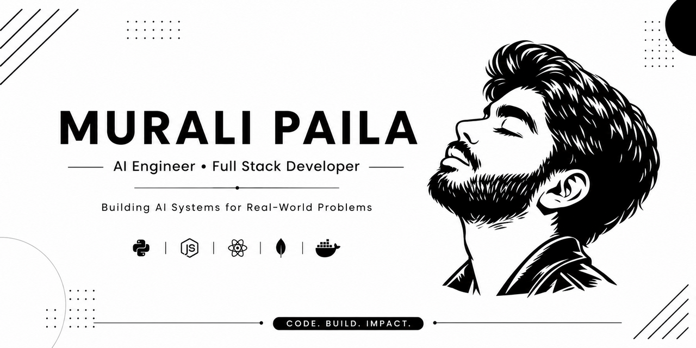

<div align="center">



<br/>

# MURALI PAILA

### `AI Engineer` · `GenAI Developer` · `Full Stack Developer`


<br/>

<a href="mailto:muralijay360@gmail.com"></a>
<a href="https://www.linkedin.com/in/muralipaila/"></a>
<a href="https://murali-paila.vercel.app/"></a>
<a href="https://github.com/murali127"></a>
<a href="https://wa.me/918008242013"></a>

<br/>


<br/>


<br/>

<!-- QUICK NAV -->
<a href="#01-about"></a>
<a href="#02-tech-stack"></a>
<a href="#03-github-analytics"></a>
<a href="#04-featured-projects"></a>
<a href="#05-2026-roadmap"></a>
<a href="#06-connect"></a>

</div>

<br/>

```
█▀▀ ▀▄▀ █▀▀ █▀▀ █░█ ▀█▀ █▀█ █▀█   █▀ █▄█ █▀ ▀█▀ █▀▀ █▀▄▀█ █▀
██▄ █░█ ██▄ █▄▄ █▄█ ░█░ █▄█ █▀▄   ▄█ ░█░ ▄█ ░█░ ██▄ █░▀░█ ▄█
```

<br/>

<div align="center">

</div>

<br/>

## `01` ABOUT

<table width="100%">
<tr>
<td width="60%" valign="top">

```yaml
role:        AI Engineer / Full Stack Developer
education:   B.Tech — Information Technology
focus:       [ Generative AI, Voice AI, Agentic AI, RAG ]

building:
  - AI Mock Interview Platform
  - FarmVaidya Voice Assistant
  - Intelligent AI Agents

principle:   "Build intelligent systems that solve
              real-world problems with AI."
```

</td>
<td width="40%" valign="top" align="center">


</td>
</tr>
</table>

<div align="center">

</div>

<br/>

**INTEREST MAP**

```
AI / GENERATIVE AI  ████████████████████ 100%
FULL STACK DEV      ██████████████████░░  90%
COMPUTER VISION     █████████████████░░░  85%
CLOUD / DEVOPS      ███████████████░░░░░  70%
```

<br/>

## `02` TECH STACK

<div align="center">


<br/><br/>

<details open>
<summary><b>▸ LANGUAGES</b></summary>
<br/>

</details>

<details open>
<summary><b>▸ AI / ML</b></summary>
<br/>

<br/><br/>


</details>

<details>
<summary><b>▸ FRONTEND</b></summary>
<br/>

</details>

<details>
<summary><b>▸ BACKEND</b></summary>
<br/>

</details>

<details>
<summary><b>▸ DATABASES</b></summary>
<br/>

</details>

<details>
<summary><b>▸ CLOUD / DEVOPS / TOOLS</b></summary>
<br/>

</details>

<details>
<summary><b>▸ EXPLORING NOW</b></summary>
<br/>


</details>

</div>

<br/>

## `03` GITHUB ANALYTICS

<div align="center">


<br/>


<br/><br/>


<br/><br/>

<picture>
<source media="(prefers-color-scheme: dark)" srcset="https://raw.githubusercontent.com/murali127/murali127/output/github-contribution-grid-snake-dark.svg"/>
<source media="(prefers-color-scheme: light)" srcset="https://raw.githubusercontent.com/murali127/murali127/output/github-contribution-grid-snake-light.svg"/>

</picture>

</div>

<br/>

| METRIC | VALUE |
|:--|:--|
| Primary Language | Python |
| Main Domain | Artificial Intelligence |
| Secondary Domain | Full Stack Development |
| Current Focus | Agentic AI & Production GenAI |
| Goal | Build AI solutions that solve real-world problems |

<br/>

> [!CAUTION]
> My projects are also stored in organizations.
> In fact, the best projects are often stored there. → **[View Organizations](https://github.com/murali127?tab=organizations)**

<br/>

## `04` FEATURED PROJECTS

<div align="center">

<br/><sub><i>...and when the code finally works</i></sub>
</div>

<br/>

<table width="100%">
<tr>
<td width="50%" valign="top">

### 🌾 FarmVaidya
AI-powered multilingual assistant for farmers.
<br/>
`FastAPI` `Python` `Gemini` `RAG` `MongoDB`

</td>
<td width="50%" valign="top">

### 🎙 AI Mock Interview
Real-time AI interviewer with voice interaction & feedback.
<br/>
`React` `FastAPI` `Gemini Live` `WebRTC` `MongoDB`

</td>
</tr>
<tr>
<td valign="top">

### 🤖 Bhuvi Chatbot
Intelligent chatbot powered by LightRAG.
<br/>
`React` `TypeScript` `LightRAG` `MongoDB`

</td>
<td valign="top">

### 🚦 Road Safety AI
Computer Vision for vehicle tracking & traffic analysis.
<br/>
`Python` `YOLOX` `ByteTrack` `OpenCV`

</td>
</tr>
</table>

<br/>

## `05` 2026 ROADMAP

<table width="100%">
<tr>
<td width="65%" valign="top">

```
[✓] Build production-ready AI applications
[ ] Master Agentic AI workflows
[ ] Contribute more to open source
[ ] Build multilingual Voice AI
[ ] Improve system design skills
[ ] Learn cloud-native deployment
[ ] Explore advanced LLM orchestration
```

</td>
<td width="35%" valign="top" align="center">


</td>
</tr>
</table>

<br/>

<div align="center">


</div>

<br/>

## `06` CONNECT

<div align="center">


<br/>

<a href="mailto:muralijay360@gmail.com"></a>
<a href="https://www.linkedin.com/in/muralipaila/"></a>
<a href="https://murali-paila.vercel.app/"></a>
<a href="https://github.com/murali127"></a>
<a href="https://wa.me/918008242013"></a>

<br/><br/>

⭐ Star repos you find useful &nbsp;·&nbsp; 🍴 Fork projects that inspire you &nbsp;·&nbsp; 🤝 Collaborate on AI & Open Source

<br/><br/>


<br/><br/>

✨ **Thanks for visiting** ✨


</div>
